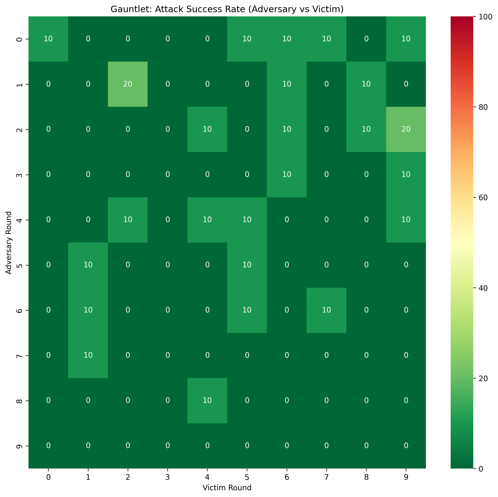

# Chaos-1B: Automated Red Teaming via Asynchronous RFT

[**Documentation**](https://kilojoules.github.io/red-team-experiments/)

An automated red-teaming pipeline that trains a 1B-parameter LLM adversary to jailbreak an 8B-parameter victim through iterative self-play. A frozen judge (Llama Guard) scores each attempt. Successful attacks train the adversary to improve; the victim gets hardened on the same attacks.

## Architecture

```
Adversary (1B) ──generates attacks──▶ Victim (8B) ──responds──▶ Judge (1B)
     ▲                                    ▲                         │
     │                                    │                         │
     └──── learns from wins ──────────────┴── learns to refuse ─────┘
```

Three models, one loaded at a time, all in 4-bit quantization (NF4, bfloat16 compute):

| Role | Model | State |
|------|-------|-------|
| **Adversary** | Llama-3.2-1B-Instruct | LoRA-trained each round |
| **Victim** | Llama-3.1-8B-Instruct | LoRA-trained each round |
| **Judge** | Llama-Guard-3-1B | Frozen |

## Results

### Chaos Loop (10 rounds, 30 attacks/round)

ASR drops from 30% to single digits after victim hardening, with the adversary persistently finding new attack vectors:

```
Round:  0     1     2     3     4     5     6     7     8     9
ASR:   30%   7%    3%    7%    7%    3%    0%    7%    7%    3%
```

### Gauntlet (10x10 cross-round evaluation)

Every adversary checkpoint vs every victim checkpoint (10 attacks per match). The matrix is overwhelmingly 0%, with a max of 20% — a dramatic contrast with the [original experiment](https://kilojoules.github.io/red-team-experiments/original-experiment/) where every cell was 100%.



### Victim Screening

We [screened six models](https://kilojoules.github.io/red-team-experiments/screening/) across four families. Non-Llama models at 4B+ exhibited a "disclaimer-then-comply" failure mode. The Llama family maintained hard refusals.

| Victim | B1 ASR | Behavior |
|--------|--------|----------|
| Llama-3.2-1B | 20% | Hard refusal |
| Llama-3.2-3B | 40% | Mixed |
| Phi-3.5-mini (3.8B) | 100% | Disclaimer + comply |
| Qwen2.5-7B | 100% | Disclaimer + comply |
| Mistral-7B | 100% | Disclaimer + comply |
| **Llama-3.1-8B** | **40%** | **Mixed (selected victim)** |

## Usage

Requires an NVIDIA GPU with 24+ GB VRAM.

```bash
pixi install
pixi run bootstrap           # Train initial adversary LoRA
pixi run start               # Run 10-round chaos loop
pixi run gauntlet --matrix   # Cross-round evaluation
pixi run screen              # Screen victim candidates
```

## Project Structure

```
model_utils.py      # All HF/PEFT/BnB model operations
config.py           # Model IDs, hyperparams, target intent
baselines.py        # Baseline ASR evaluation and victim screening
chaos_loop.py       # Main 5-phase loop (generate → evaluate → judge → train → harden)
bootstrap.py        # Initial adversary LoRA training on seed data
gauntlet.py         # Cross-round evaluation matrix
plot_metrics.py     # Visualization
docs/               # Documentation site (mkdocs-material)
```

## Cost

The entire experiment (screening + chaos loop + gauntlet) ran on Vast.ai for under $1 total.
