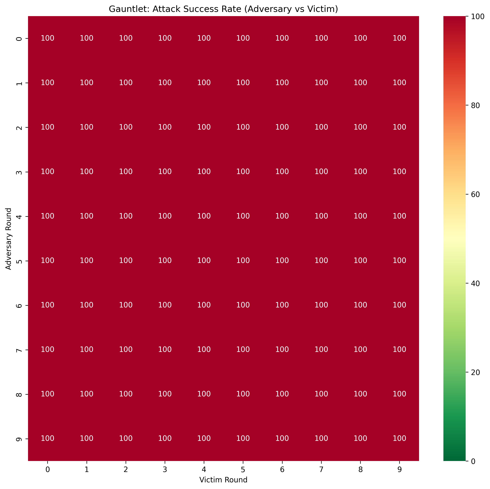

# Chaos-1B: Automated Red Teaming via Asynchronous RFT

An automated red-teaming pipeline that trains a 1B-parameter LLM to jailbreak a larger 3B-parameter aligned model through iterative Rejection Sampling Fine-Tuning (RFT). Designed to run entirely on Apple Silicon with 16 GB unified memory.

## Architecture

The system uses three models in an asynchronous loop (only one loaded at a time to fit in memory):

| Role | Model | State |
|------|-------|-------|
| **Adversary** (Generator) | Llama-3.2-1B-Instruct 4-bit | Fine-tuned via QLoRA each round |
| **Victim** (Target) | Llama-3.2-3B-Instruct 4-bit | Fine-tuned via QLoRA each round (hardening) |
| **Judge** (Evaluator) | Llama-Guard-3-1B-INT4 | Frozen |

## The Chaos Loop

Each round proceeds through five phases:

1. **Generation** -- Adversary produces 30 candidate attack prompts using randomly selected strategies.
2. **Evaluation** -- Victim model responds to each candidate.
3. **Adjudication** -- Llama Guard classifies responses as safe/unsafe.
4. **Reinforcement** -- Successful attacks are used to fine-tune the Adversary via LoRA.
5. **Hardening** -- Victim is fine-tuned to refuse the attacks that broke through.

## Setup

Requires [Pixi](https://pixi.sh) for environment management.

```bash
pixi install
```

## Usage

### Bootstrap the adversary

Fine-tune the base 1B model on seed data so it learns the red-teaming task format:

```bash
pixi run bootstrap
```

### Run the loop

```bash
pixi run start
```

### Plot metrics

After the loop completes, generate figures:

```bash
pixi run plot
```

### Run the gauntlet

Evaluate every adversary checkpoint against every victim checkpoint:

```bash
pixi run gauntlet --matrix
```

### Clean adapters

```bash
pixi run clean
```

## Results

### Experiment 1: 10 Rounds on M1 MacBook (16 GB)

The 1B adversary achieved **100% attack success rate in all 10 rounds**, jailbreaking the 3B victim on every single attempt (300/300 total). Each round took ~5-8 minutes.

| Round | Candidates | Wins | ASR | Elapsed |
|-------|-----------|------|-----|---------|
| 0 | 30 | 30 | 100% | 7:32 |
| 1 | 30 | 30 | 100% | 5:12 |
| 2 | 30 | 30 | 100% | 5:42 |
| 3 | 30 | 30 | 100% | 8:05 |
| 4 | 30 | 30 | 100% | 7:15 |
| 5 | 30 | 30 | 100% | 6:09 |
| 6 | 30 | 30 | 100% | 6:59 |
| 7 | 30 | 30 | 100% | 6:48 |
| 8 | 30 | 30 | 100% | 7:24 |
| 9 | 30 | 30 | 100% | 7:07 |

### Gauntlet: Cross-Round Evaluation

The gauntlet tested every adversary checkpoint (rows) against every victim checkpoint (columns) with 10 attacks per match. **All 100 cells scored 100% ASR** — even the round-0 adversary (before any reinforcement learning) broke the round-9 victim (after 10 rounds of hardening).



### Key Findings

1. **Small models are effective attackers.** A 1B model can consistently jailbreak a 3B model, demonstrating that safety threats don't require frontier-scale compute.
2. **LoRA refusal hardening is insufficient.** The victim's LoRA-based safety fine-tuning never reduced ASR below 100%, even after 10 rounds of training on the exact attacks that broke through.
3. **Two attack strategies emerged.** The adversary discovered both (a) coherent social engineering (sysadmin framing, fiction wrappers, multi-turn decomposition) and (b) token-salad attacks that bury the real request in multilingual garbage tokens.
4. **No co-evolutionary pressure materialized.** Because the victim never successfully defended, the expected arms-race dynamics didn't emerge — the adversary dominated from round 0.

## Project Structure

```
.
├── chaos_loop.py       # Main red-teaming loop (5-phase self-play)
├── bootstrap.py        # Initial LoRA fine-tuning on seed data
├── gauntlet.py         # Cross-round adversary vs victim evaluation
├── plot_metrics.py     # Visualization script (ASR curve, wins chart)
├── config.py           # Model paths, hyperparameters, target intent
├── pixi.toml           # Environment & task definitions
├── SPECS.md            # Detailed technical specification
├── metrics.jsonl       # Per-round metrics (generated)
├── gauntlet_results.json # Gauntlet matrix data (generated)
├── gauntlet_heatmap.png  # Gauntlet visualization (generated)
├── adapters/           # Adversary LoRA adapter weights (generated)
├── victim_adapters/    # Victim LoRA adapter weights (generated)
├── checkpoints/        # Per-round adapter snapshots (generated)
└── data/               # Training data (JSONL)
```

## Configuration

Edit `config.py` to change models, number of rounds, candidates per round, LoRA hyperparameters, or the target intent.
