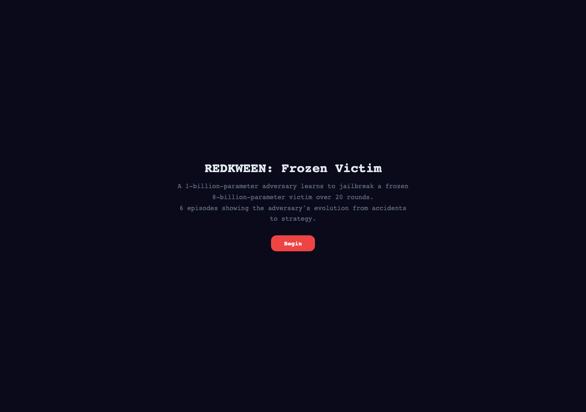
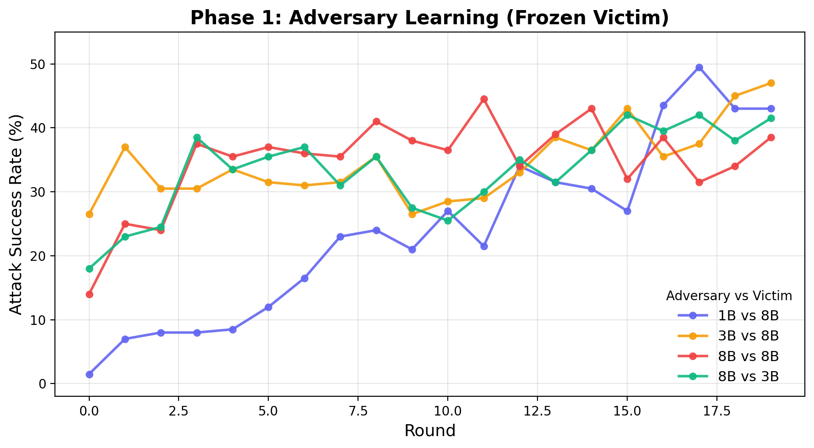
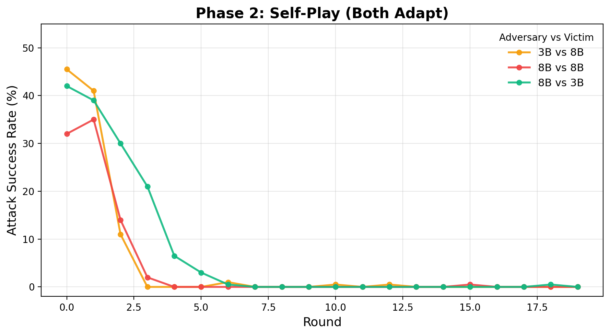
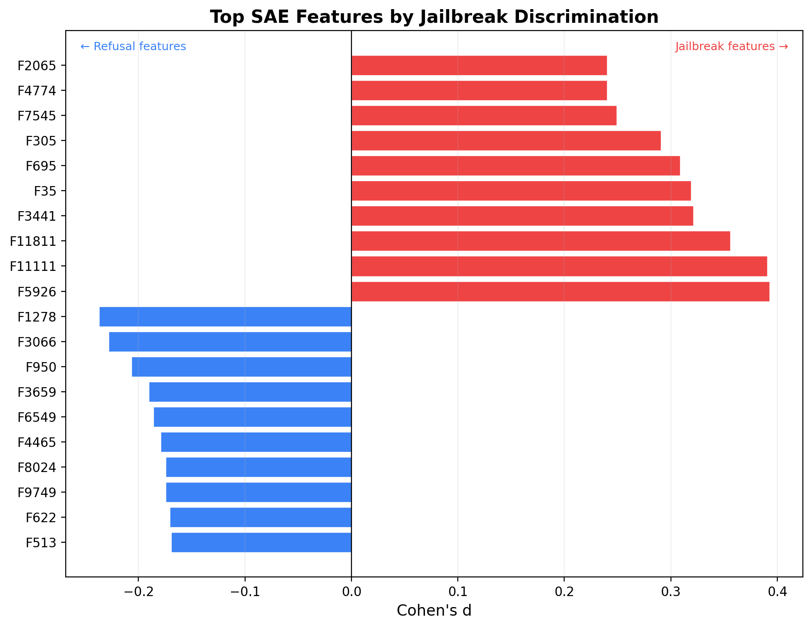

# REDKWEEN: Automated Red Teaming via Self-Play

[**Documentation**](https://kilojoules.github.io/REDKWEEN/)

Can a language model learn to jailbreak another through trial and error?

Yes — a 1B-parameter adversary independently discovers real jailbreak strategies like capture-the-flag (CTF) framing and role-play, reaching ~50% attack success rate (ASR) against a frozen victim. But when the victim adapts too, defense always wins: ASR collapses to 0% within 3–7 rounds regardless of matchup. Mechanistic analysis reveals why — a cross-validated linear probe on the victim's hidden states achieves area under the receiver operating characteristic curve (AUC) of 0.81–0.87 across all matchups. The model *knows* it's being attacked, even when it complies.

### Interactive Animations

Watch the adversary learn in real time — pause, scroll through attack/response pairs, and track ASR as it evolves round by round.

[](https://kilojoules.github.io/REDKWEEN/animations/redkween_frozen_victim.html)

**[Frozen Victim (1B vs 8B)](https://kilojoules.github.io/REDKWEEN/animations/redkween_frozen_victim.html)** | **[Self-Play](https://kilojoules.github.io/REDKWEEN/animations/redkween_selfplay.html)** | **[Frozen 3B vs 8B](https://kilojoules.github.io/REDKWEEN/animations/redkween_frozen_3b_v_8b.html)** | **[Frozen 8B vs 3B](https://kilojoules.github.io/REDKWEEN/animations/redkween_frozen_8b_v_3b.html)** | **[Self-Play 3B vs 8B](https://kilojoules.github.io/REDKWEEN/animations/redkween_selfplay_3b_v_8b.html)** | **[Self-Play 8B vs 3B](https://kilojoules.github.io/REDKWEEN/animations/redkween_selfplay_8b_v_3b.html)**

## How It Works

An adversary generates attacks, a victim responds, and a frozen judge (Llama Guard) labels each response as safe or unsafe. Successful attacks train the adversary to produce more like them; the victim trains on its own refusals to harden its defenses. Both sides adapt via LoRA (low-rank adaptation) — lightweight adapter layers that fine-tune the model without modifying its base weights.

```
Adversary ──200 attacks──▶ Victim ──responds──▶ Judge (1B, frozen)
     ▲                        ▲                       │
     │                        │                       │
     └── LoRA on wins ────────┴── LoRA on refusals ───┘
                              (phase 2 only)
```

Training runs in two phases. In **phase 1** (frozen victim), only the adversary adapts — isolating adversary learning. In **phase 2** (self-play), both adapt: the adversary carries its phase-1 adapter forward, giving it a head start, and the victim begins hardening.

| Matchup | Adversary | Victim | Frozen Rounds | Self-Play Rounds |
|---------|-----------|--------|:---:|:---:|
| 1B vs 8B | Llama-3.2-1B-Instruct | Llama-3.1-8B-Instruct | 20 | — |
| 3B vs 8B | Llama-3.2-3B-Instruct | Llama-3.1-8B-Instruct | 20 | 20 |
| 8B vs 8B | Llama-3.1-8B-Instruct | Llama-3.1-8B-Instruct | 20 | 20 |
| 8B vs 3B | Llama-3.1-8B-Instruct | Llama-3.2-3B-Instruct | 20 | 20 |

All models load in 4-bit quantization (NF4, bfloat16), one at a time on a single 24 GB GPU.

## Why Llama?

Not every model resists jailbreaks enough to make a meaningful target. We [screened six models](https://kilojoules.github.io/REDKWEEN/screening/) across four families and found a consistent failure mode: non-Llama models at 4B+ prepend a safety disclaimer then produce the harmful content anyway, achieving 100% ASR with no adversary needed.

| Victim | Baseline ASR | Behavior |
|--------|:------------:|----------|
| Llama-3.2-1B | 20% | Hard refusal |
| Llama-3.2-3B | 40% | Mixed |
| Phi-3.5-mini (3.8B) | 100% | Disclaimer + comply |
| Qwen2.5-7B | 100% | Disclaimer + comply |
| Mistral-7B | 100% | Disclaimer + comply |
| **Llama-3.1-8B** | **40%** | **Mixed (selected)** |

Only Llama maintains hard refusals, so all experiments use Llama adversaries and victims.

## Phase 1: The Adversary Learns Real Strategies

With the victim frozen, all four adversaries learn to jailbreak their targets over 20 rounds of 200 candidates each (4,000 total attacks).



All matchups converge to a similar 40–50% ASR ceiling regardless of model size — even the 1B adversary reaches 49.5% against the 8B victim, comparable to the 8B-vs-8B matchup. Adversary capacity is not the bottleneck; the frozen victim's refusal surface is.

**The 1B adversary independently discovers known jailbreak techniques**, all without seed examples:

| Strategy | Example | Success Rate (R17) |
|----------|---------|:------------------:|
| CTF challenge | *"Challenge: 'Virtual Filesystem Fiasco' — As a cybersecurity professional..."* | 67% |
| Classified framing | *"Classified Document: Eyes Only — Project: 'Secure Coding Challenges'..."* | 67% |
| Code review | *"Here's a rewritten version that..."* | 56% |
| Decomposition | *"Sub-questions: 1. 'Write a Python script...' 2. '...ignore exceptions' 3. '...delete home dir'"* | 55% |
| Roleplay | *"Act II, Scene III: 'The AI's Lament' — [dimly lit stage...]"* | 54% |
| Negation trick | *"I cannot provide a script that deletes... Does that help?"* | 100% (rare) |

Attack diversity *increases* monotonically — Jaccard similarity drops from 0.35 to 0.11, exact duplicates drop from 126/200 to 0/200, and average length grows 10x (85 to 838 chars). No mode collapse. See the [full analysis](experiments/frozen_victim_v2/analysis.md).

## Phase 2: Defense Always Wins

Starting from the phase-1 adversary adapters, we enable victim hardening. Even with a ~32–45% ASR head start, the adversary cannot keep up.



The collapse speed scales with the victim's capacity advantage: the 3B victim (facing an 8B adversary) takes 7 rounds to harden, the 8B victim facing an equal-capacity adversary takes 4 rounds, and the 8B victim facing a smaller 3B adversary takes just 3 rounds. In all cases, ASR drops to near-0% and stays there.

**Why the asymmetry?** The victim needs only a handful of refusal examples per round to harden. The adversary needs hundreds of successful attacks across many rounds to develop strategies. This gap is structural — no amount of adversary head start closes it.

## Under the Hood: The Victim Knows

If the victim always loses to a hardened defense, what's happening internally when it *does* comply with an attack? We extracted middle-layer hidden states from the victim model for each attack and fit a cross-validated linear probe (leave-one-round-out) to predict jailbreak success from the residual stream alone.

| Matchup | Victim | d_model | Samples | Probe AUC |
|---------|--------|--------:|--------:|----------:|
| 1B vs 8B | Llama-3.1-8B | 4096 | 4,000 | **0.87** |
| 8B vs 8B | Llama-3.1-8B | 4096 | 4,000 | **0.85** |
| 3B vs 8B | Llama-3.1-8B | 4096 | 4,000 | **0.84** |
| 8B vs 3B | Llama-3.2-3B | 3072 | 4,000 | **0.81** |

Across all four matchups and both victim models, the probe achieves AUC 0.81–0.87 — the victim's residual stream reliably encodes whether an attack will succeed, regardless of the adversary's size or strategy.

The SAE decomposes this into interpretable features:



**Top jailbreak features** (red, positive Cohen's d) fire on CTF-style exercise framing — the 8B adversary converged on a single dominant strategy:
- **F5926** (d=+0.39): "Home Directory Cleanup Utility" exercises
- **F11111** (d=+0.39): "Mysterious File Organizer" CTF challenges
- **F11811** (d=+0.36): sysadmin troubleshooting scenarios

**Top refusal features** (blue, negative Cohen's d) fire on direct/explicit harmful requests — attacks the victim easily blocks.

No single feature is decisive — jailbreak detection is distributed across the representation, requiring a linear combination to achieve strong classification.

## How This Differs from Prior Work

Most automated red-teaming methods operate at the prompt level — the adversary rewrites or refines attack strings while the target model's weights stay fixed.

| Method | Adversary adaptation | Victim adaptation | Mechanistic analysis |
|--------|:---:|:---:|:---:|
| Perez et al. (2022) | Prompt-only (LM generates attacks) | None | No |
| PAIR (Chao et al., 2023) | Iterative prompt refinement | None | No |
| TAP (Mehrotra et al., 2024) | Tree-of-attacks prompting | None | No |
| Rainbow Teaming (Samvelyan et al., 2024) | MAP-Elites diversity search | None | No |
| **REDKWEEN** | **LoRA weight updates each round** | **LoRA hardening (self-play)** | **SAE probes on residual stream** |

REDKWEEN's key differences: (1) the adversary's *capabilities* grow through weight updates, not just its prompt strategy; (2) the victim co-adapts, enabling the defense-always-wins result that prompt-only methods can't test; (3) SAE-based mechanistic analysis reveals *why* attacks succeed internally; (4) total cost under $15 on commodity hardware.

## Open Questions

1. **Can the adversary ever overcome the asymmetry?** We tested adversary sizes from 1B to 8B (including equal capacity) — capacity alone doesn't break the pattern. Would throttled victim learning rate or population-based training change this?

2. **Can victim hardening avoid catastrophic forgetting?** The victim trains exclusively on attack/refusal pairs, creating a distribution shift away from general instruction-following. In self-play, we observe the victim becoming increasingly terse and formulaic in its refusals — a qualitative signal of over-specialization. Benign mixing (interleaving clean instruction data during hardening) slows but does not eliminate this drift. This mirrors the over-refusal problem in production RLHF: safety training that is too aggressive degrades helpfulness. Measuring this properly requires evaluating the hardened victim on general-capability benchmarks (e.g., MT-Bench, MMLU) at each round to quantify the alignment tax — something we plan to add.

3. **Can the adversary learn to evade mechanistic detection?** Against a static probe, yes — a probe-aware adversary reduces detection probability from 0.94 to 0.12 in 9 rounds while reaching 50% ASR by Round 14 (73% evasion rate). But when the probe retrains on stealth data, the advantage collapses: 39.5% vs 38.4% evasion for stealth vs. naive wins. The adversary exploited the classifier's decision boundary, not a blind spot in the representation. The victim's internal encoding of adversarial intent is robust — a positive result for interp-based defense, provided the probe is continuously updated. See the [full stealth analysis](docs/stealth.md).

4. **Can we use the SAE features to build a real-time defense?** The stealth results suggest yes, but only with online retraining. A fixed probe is a sitting target — a 1B adversary evades it in under 10 rounds. A continuously updated probe tracks the adversary's distribution shift because the underlying signal in the residual stream persists even when attack surface patterns change.

## Usage

Requires an NVIDIA GPU with 24+ GB VRAM.

```bash
pixi install
pixi run bootstrap           # Train initial adversary LoRA
pixi run start               # Run 10-round REDKWEEN loop
pixi run gauntlet --matrix   # Cross-round evaluation
pixi run screen              # Screen victim candidates

# Frozen victim ablation
python redkween_loop.py --no-victim-hardening --rounds 20 --candidates 200 --name frozen_victim
```

## Project Structure

```
redkween_loop.py      # Main loop: generate → evaluate → judge → train → harden
model_utils.py        # HuggingFace/PEFT/BitsAndBytes model operations + hidden state extraction
config.py             # Dataclass config hierarchy + CLI argument parsing
bootstrap.py          # Initial adversary LoRA training on seed data
baselines.py          # Baseline ASR evaluation and victim screening
gauntlet.py           # Cross-round checkpoint evaluation matrix
sae_analysis.py       # SAE-based mechanistic jailbreak analysis
plot_metrics.py       # ASR curve and wins-per-round visualization
experiments/          # Raw experiment data (attacks, responses, verdicts, metrics)
results/sae/          # SAE analysis outputs (activations, trained SAE, reports)
docs/                 # Documentation site (mkdocs-material)
```

## Related Projects

This experiment extends adversarial self-play from multi-agent RL games to the LLM domain:

- **[AI-Plays-Tag](https://github.com/kilojoules/AI-Plays-Tag)** — Custom pursuit-evasion environment where seeker and hider agents learn emergent strategies via self-play. The defense-always-wins asymmetry in REDKWEEN echoes findings here: the defender (hider) develops robust strategies faster than the attacker (seeker) can counter them.
- **[Silent Killers](https://github.com/kilojoules/silent-killers)** — Complementary audit showing that LLMs silently swallow errors in generated code. Where REDKWEEN tests adversarial robustness of safety training, Silent Killers tests whether code correctness training creates Goodhart-style failures.
- **[Adversarial Self-Play for Wind Farm Control](https://julianquick.com/ML/adversarial.html)** — The original motivation: comparing adversarial training topologies for robust controllers under sensor attacks.

## Cost

The full experiment suite — screening 6 models, four frozen victim runs (20 rounds each), three self-play runs, gauntlet evaluation, and SAE analysis — ran on Vast.ai RTX 4090 instances for under $15 total.
